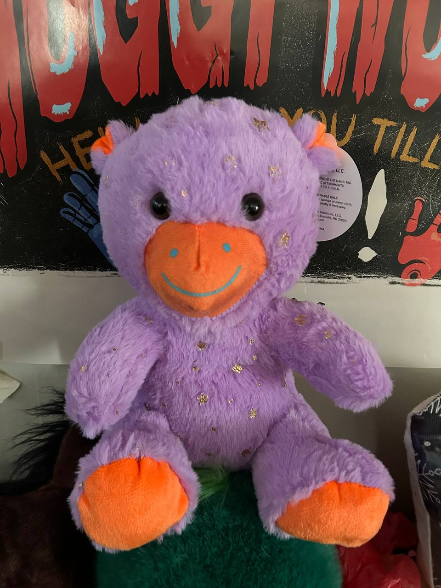

<p align="center">
  
</p>

# Slermes ☤ — C Translation of Hermes Agent

**Slermes** is a zero-dependency [C translation](slermes/) of the Python [Hermes Agent](https://github.com/NousResearch/hermes-agent) by Nous Research. One static binary, zero runtime deps beyond libc + libssl.

<p align="center">
  
</p>

This repo (`waefrebeorn/slermes`) is a fork of [NousResearch/hermes-agent](https://github.com/NousResearch/hermes-agent) with the C translation living in [`slermes/`](slermes/). The Python reference implementation lives at the repo root (tracking upstream).

| Aspect | Python (upstream) | C (Slermes) |
|--------|-------------------|-------------|
| **Location** | Repo root (upstream tracking) | [`slermes/`](slermes/) |
| **Binary** | `hermes` (Python + uv) | `slermes` (static ELF, 31M) |
| **Deps** | Python 3.11+, uv, Node.js | libc + libssl only |
| **Suite** | ~17k pytest tests | 325/0/14 C tests |
| **Readme** | [Upstream Hermes Agent docs](https://hermes-agent.nousresearch.com/docs) | [`slermes/README.md`](slermes/README.md) |

<p align="center">
  <a href="slermes/README.md"></a>
  <a href="slermes/.hermes/mind-palace/battleship-v34.md"></a>
  <a href="slermes/.hermes/mind-palace/vault/achievements.md"></a>
  <a href="https://github.com/waefrebeorn/slermes"></a>
</p>

---

## Quick Start (C)

```bash
cd slermes/
make -j$(nproc)            # Build slermes binary
./slermes --help           # Usage
bash test_runner.sh        # 325/0/14 suite
```

See [slermes/README.md](slermes/README.md) for full build docs, architecture, tool list, gateway platforms, and provider support.

## Project Structure

```
waefrebeorn/slermes/
├── slermes/                    ← Slermes C translation (all source)
│   ├── src/                    ←   174 .c files (agent, tools, CLI, gateway, cron)
│   ├── lib/                    ←   65 library modules (json, http, crypto, mcp, ...)
│   ├── tests/                  ←   239 test files (325/0/14 suite)
│   ├── include/                ←   Master header + subsystem headers
│   ├── assets/                 ←   Slermes stuffy mascot image
│   ├── .hermes/                ←   Mind-palace docs, battleship, vault
│   │   └── mind-palace/        ←     Walkway files, battleship, achievements
│   └── README.md               ←   Full C build/architecture docs
├── assets/                     ←   Python upstream assets
├── ...python source...         ←   Upstream Python Hermes Agent reference
└── README.md                   ←   This file (Slermes repo entry point)
```

## History

This repo started as a straight fork of `NousResearch/hermes-agent` at commit `2517917de`. All C translation work lives in `slermes/`. The original 277-commit development history is preserved on the [`c-work`](https://github.com/waefrebeorn/slermes/tree/c-work) branch for reference — squashed into a single commit on `main` for clean upstream tracking.

- **Fork:** [waefrebeorn/slermes](https://github.com/waefrebeorn/slermes)
- **Upstream:** [NousResearch/hermes-agent](https://github.com/NousResearch/hermes-agent)
- **Old dev branch:** [`c-work`](https://github.com/waefrebeorn/slermes/tree/c-work) (277 original C commits)
- **Battleship:** [v34 — 68 parity gaps](slermes/.hermes/mind-palace/battleship-v34.md)
- **Vault:** [Achievements log](slermes/.hermes/mind-palace/vault/achievements.md)

## Parity Status

| Metric | Value |
|--------|-------|
| Fork state | 0 behind, 2 ahead of upstream |
| Suite | 325 passed, 0 failed, 14 skipped |
| Tools | 85 registered |
| CLI | 98 commands + 37 config sections |
| Gateway | 19 platforms |
| Providers | 10 |
| Libraries | 65 C modules |
| Binary | 31M dynamic ELF |
| Warnings | 0 |
| Stubs | 0 |
| **Real parity gaps** | **68** (across 8 sectors) |

> **Honest assessment:** "0 gaps" was premature. Real parity gaps exist across form-vs-function, pipeline, cross-comparison, product features, and upstream drift. See [battleship v34](slermes/.hermes/mind-palace/battleship-v34.md).

## Upstream Python

The Python reference implementation is at the repo root (tracking upstream `NousResearch/hermes-agent:main` at `67011cc0d`). For Python usage, install and run the Python Hermes Agent:

```bash
# Python Hermes Agent (upstream)
curl -fsSL https://raw.githubusercontent.com/NousResearch/hermes-agent/main/scripts/install.sh | bash
hermes --help
```

See [upstream docs](https://hermes-agent.nousresearch.com/docs/) for full Python documentation.

---

<p align="center">
  <i>Slermes — a C translation of Hermes Agent by Nous Research.</i><br>
  <a href="slermes/.hermes/mind-palace/goal-mantra.md">Goal Loops</a> · 
  <a href="slermes/.hermes/mind-palace/state.md">State</a> · 
  <a href="slermes/.hermes/mind-palace/plan.md">Plan</a> · 
  <a href="slermes/.hermes/mind-palace/prestige_prompt.md">Priorities</a>
</p>
